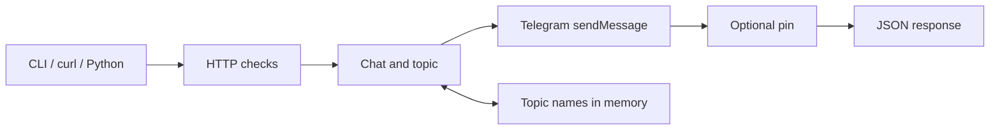

# How Gong works

Gong is one synchronous hop from your client to Telegram. It keeps no message
queue or database.

| Area | Job |
|---|---|
| `internal/cli` | Commands, config discovery, Gong HTTP client |
| `internal/config` | YAML, environment overrides, validation |
| `internal/gateway` | HTTP API, access checks, routing, levels, categories |
| `internal/topics` | In-memory topic creation and icon choice |
| `internal/telegram` | Bot API, proxy, timeouts, network error classification |

Topic mappings use `(chat_id, exact name)`. Concurrent requests for one new
name share one creation; unrelated names continue independently. A confirmed
failure releases the name. An uncertain creation holds it until restart so Gong
does not quietly create duplicates.

## Timeouts and shutdown

`telegram.timeout` limits one Telegram call. A complete notification gets up to
25 seconds; the CLI waits 30 seconds by default. On SIGINT or SIGTERM, Gong
stops accepting work, gives active requests up to 30 seconds, then cancels them.

## Network boundary

The API listens on loopback by default. Host checking without `api_token` is a
local guard, not authentication. Use a Bearer token and TLS reverse proxy for
remote access. TLS verification stays enabled for Telegram and HTTPS proxies;
Gong never bypasses a failed configured proxy with a direct connection.

## Results you can trust

Errors include a machine-readable `code` without exposing tokens or proxy
credentials. `retry_after` passes on Telegram's wait time. `uncertain: true`
means Telegram may have completed the mutation. `pin_status: "failed"` means
the message arrived but pinning did not.

`/health` only proves the local process responds. Project tests use local mock
servers, so send one deliberate Telegram notification after setup.

See [Failure handling](usage.md#handle-failures-safely) and
[Forum mappings](topics.md#what-survives-a-restart) for practical guidance.
